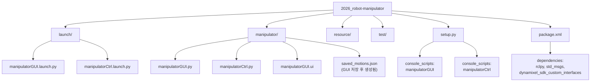
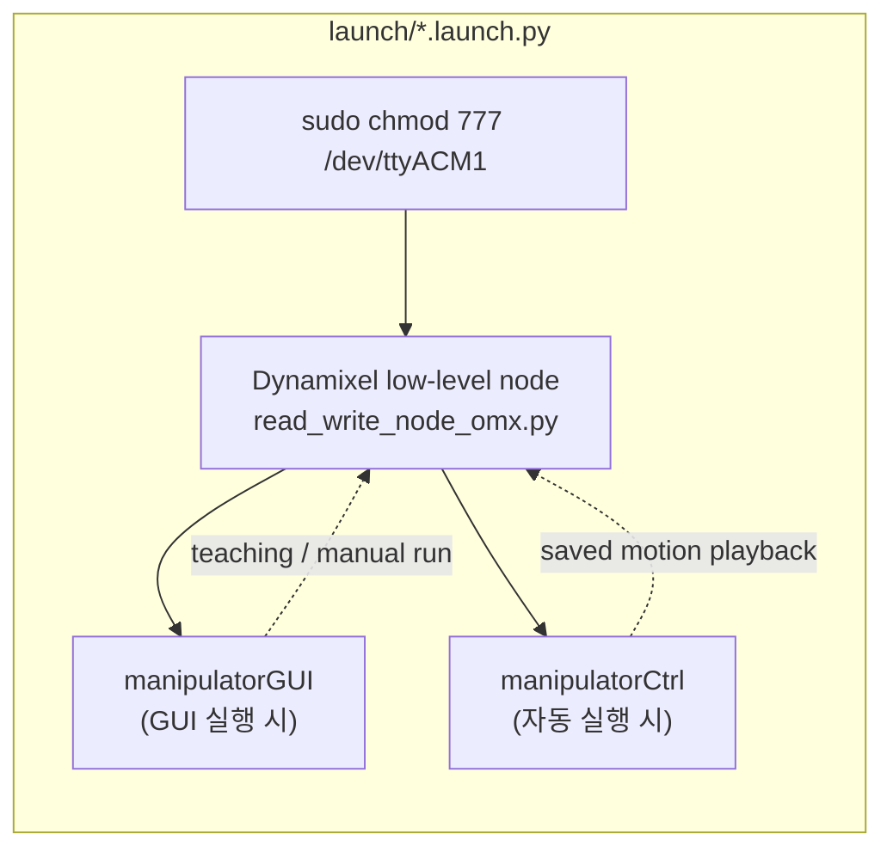
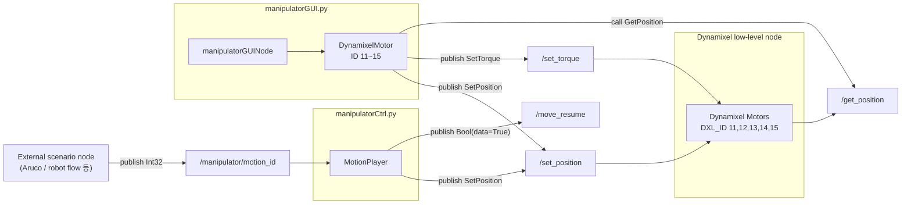
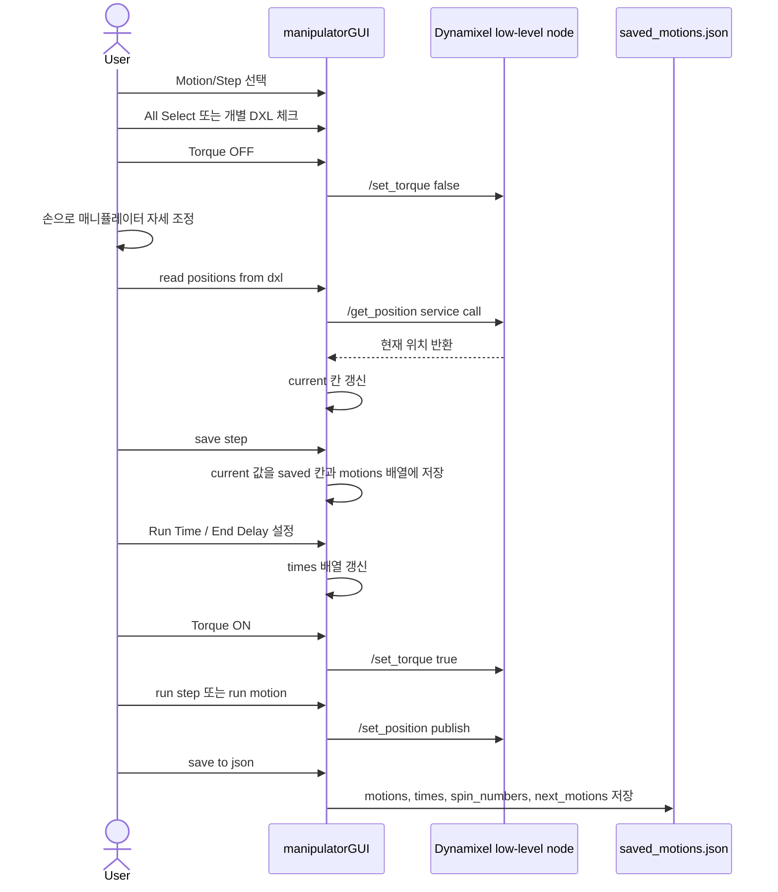
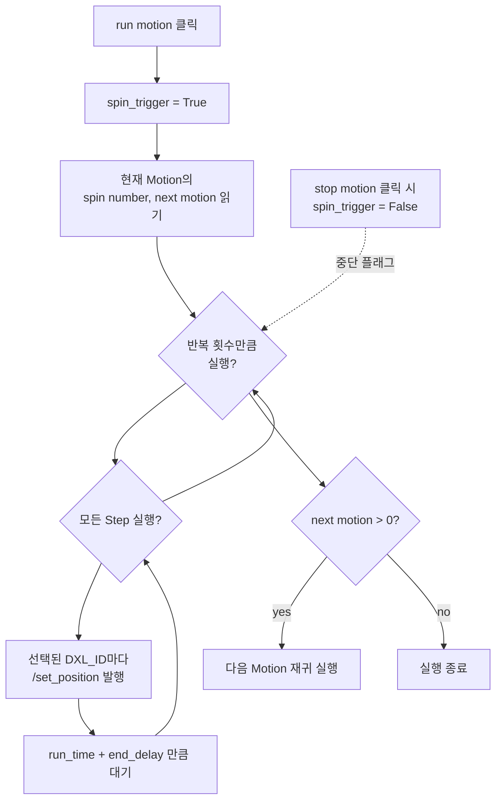
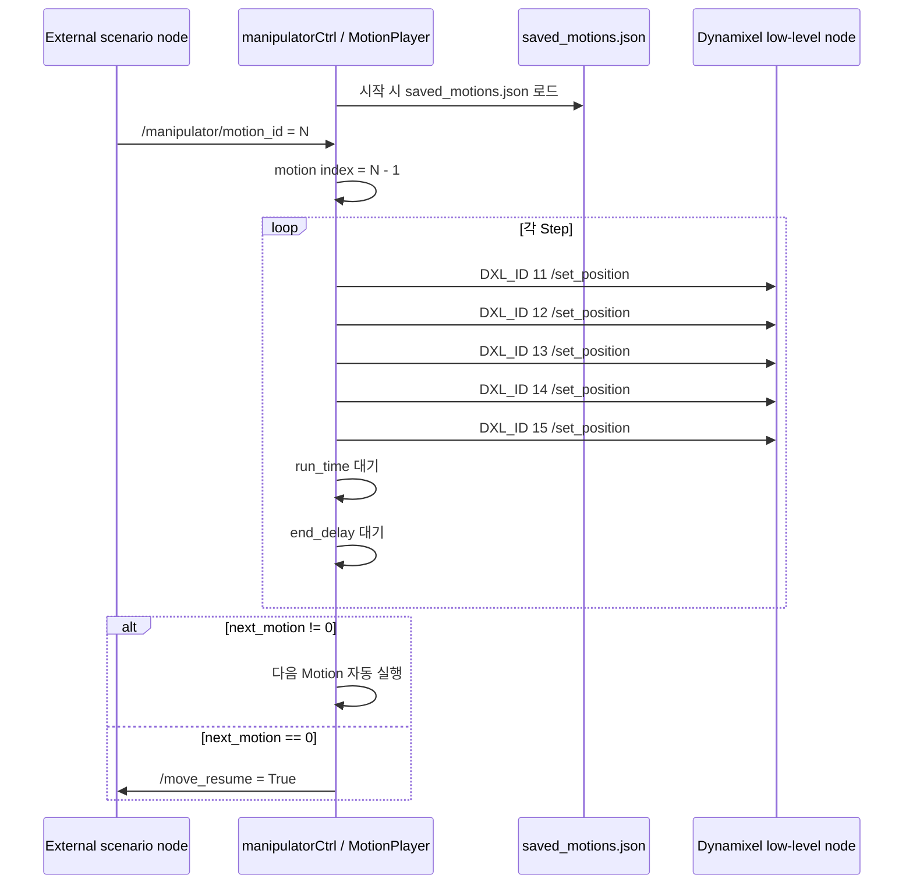

# Manipulator Package Architecture

현재 패키지의 코드 구조와 매니퓰레이터 동작 흐름 요약

핵심 ROS 2 노드 2개

- `manipulatorGUI`: 사용자가 직접 자세를 가르치고 Motion/Step을 JSON으로 저장하는 GUI 노드
- `manipulatorCtrl`: 저장된 JSON 모션을 외부 명령(`/manipulator/motion_id`)으로 실행하는 자동 재생 노드

## 1. 패키지 구조



## 2. 전체 실행 구조

두 launch 파일 모두 Dynamixel low-level 노드 선행 실행

low-level 노드: 실제 Dynamixel 통신 담당

GUI/Ctrl 노드: ROS 토픽과 서비스로 명령 송수신



## 3. ROS 토픽과 서비스 연결



### 주요 인터페이스

| 이름 | 방향 | 메시지/서비스 | 역할 |
| --- | --- | --- | --- |
| `/set_position` | GUI/Ctrl -> Dynamixel | `SetPosition` | 특정 ID 모터를 목표 위치로 이동 |
| `/set_torque` | GUI -> Dynamixel | `SetTorque` | 선택된 모터 Torque ON/OFF |
| `/get_position` | GUI -> Dynamixel | `GetPosition` service | 현재 모터 위치 읽기 |
| `/manipulator/motion_id` | 외부 -> Ctrl | `Int32` | 저장된 Motion 번호 실행 요청 |
| `/move_resume` | Ctrl -> 외부 | `Bool` | 모션 종료 후 다음 시나리오 진행 신호 |

## 4. Motion 데이터 구조

GUI에서 만든 모션의 내부 저장 형태:

```python
self.motions = [
    [
        [pos_id11, pos_id12, pos_id13, pos_id14, pos_id15],  # step 1
        [pos_id11, pos_id12, pos_id13, pos_id14, pos_id15],  # step 2
    ],
]

self.times = [
    [
        [run_time, end_delay],  # step 1
        [run_time, end_delay],  # step 2
    ],
]
```

인덱스 의미:

```text
motions[motion_index][step_index][dxl_index] = position
times[motion_index][step_index] = [run_time, end_delay]

dxl_index 0 -> DXL_ID 11
dxl_index 1 -> DXL_ID 12
dxl_index 2 -> DXL_ID 13
dxl_index 3 -> DXL_ID 14
dxl_index 4 -> DXL_ID 15
```

JSON 저장 시 함께 저장되는 값:

```json
{
  "motions": [],
  "times": [],
  "spin_numbers": [],
  "next_motions": []
}
```

`manipulatorCtrl.py` 자동 실행 기준:

| JSON key | 사용 여부 | 역할 |
| --- | --- | --- |
| `motions` | 사용 | 실행할 Step별 Dynamixel position |
| `times` | 사용 | Step별 `run_time`, `end_delay` |
| `next_motions` | 사용 | 현재 Motion 뒤 자동 실행할 Motion |
| `spin_numbers` | 미사용 | GUI의 수동 `run motion` 반복 실행에서 사용 |

## 5. `/set_position`과 Dynamixel register

GUI와 Ctrl 노드는 모두 `/set_position`에 `SetPosition` 메시지 발행.

```text
uint8 id
int32 position
float32 runtime
```

Dynamixel low-level node는 이 값을 register write로 변환.

| 메시지 필드 | 하위 노드 처리 |
| --- | --- |
| `id` | 대상 Dynamixel ID |
| `position` | `ADDR_GOAL_POSITION`에 기록 |
| `runtime` | `ADDR_PROFILE_VELOCITY`, `ADDR_PROFILE_ACCELERATION` 계산에 사용 |

관련 register:

```text
ADDR_PROFILE_VELOCITY = 112
ADDR_PROFILE_ACCELERATION = 108
ADDR_GOAL_POSITION = 116
```

`runtime`은 Python 노드에서 궤적을 직접 계산하는 값이 아니라 Dynamixel profile register에 넘기는 입력값.

## 6. GUI 티칭 흐름



## 7. GUI에서 run motion 동작

`run motion` 버튼 클릭 시 현재 선택된 Motion의 Step 순차 실행



## 8. 자동 실행 노드 동작

`manipulatorCtrl.py`: GUI 없이 저장된 JSON 재생



## 9. 코드별 역할 정리

### `manipulatorGUI.py`

- PyQt5 GUI와 ROS 2 Node 동시 상속
- `DynamixelMotor` 클래스로 각 모터 ID 래핑
- 버튼 클릭 콜백에서 토크, 위치 읽기, 위치 저장, 모션 실행, JSON 저장/불러오기 처리
- GUI 실행 중 별도 thread에서 `rclpy.spin()` 실행, Qt 이벤트 루프와 ROS 콜백 병행 사용

### `manipulatorCtrl.py`

- 시작 시 `saved_motions.json` 읽기
- `/manipulator/motion_id` 수신 시 해당 Motion 실행
- Motion 실행 중 중복 실행 방지를 위해 `is_playing` 플래그 사용
- Motion 종료 후 다음 Motion이 없으면 `/move_resume`으로 완료 신호 발행

### `manipulatorGUI.ui`

- Qt Designer에서 만든 화면 배치 파일
- 코드에서 `uic.loadUiType()`으로 읽어 Python GUI 객체에 연결
- `readButton`, `torqueOnButton`, `stepRunButton` 같은 위젯 이름과 `manipulatorGUI.py` 콜백 연결

### `launch/manipulatorGUI.launch.py`

- 포트 권한 설정
- Dynamixel low-level node 실행
- `manipulatorGUI` 실행

### `launch/manipulatorCtrl.launch.py`

- 포트 권한 설정
- Dynamixel low-level node 실행
- `manipulatorCtrl` 실행

## 10. 한 줄 요약


